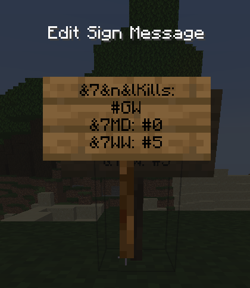
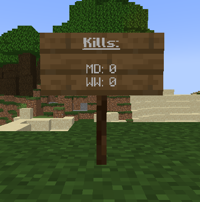

# Milk Wars

A plugin for a CTF-like PVP event for Geek NZ.

Geek NZ is a New Zealand-based Minecraft SMP server. From the [minecraft-mp page](https://minecraft-mp.com/server-s13774):

> Our small New Zealand based server has always been popular with friends and family. We run a vanilla server on PaperMC with a few small additions to make life a little easier. If you are a nice person you are welcome to join us.

<!--
####################
# TABLE OF CONTENTS
####################
-->
# Table of contents

* [Introduction](#introduction)
* [Usage](#usage)
    * [For players](#for-players)
        * [Capturing the other clan's treasure](#capturing-the-other-clans-treasure)
        * [Preventing the other clan from capturing your treasure](#preventing-the-other-clan-from-capturing-your-treasure)
        * [Getting kills](#getting-kills)
    * [For clan leaders](#for-clan-leaders)
        * [Managing your clan members](#managing-your-clan-members)
        * [Managing your clan treasure](#managing-your-clan-treasure)
    * [For admins](#for-admins)
        * [Joining and leaving a clan](#joining-and-leaving-a-clan)
        * [Promoting and demoting clan leaders](#promoting-and-demoting-clan-leaders)
        * [Changing chat colours](#changing-chat-colours)
        * [Creating smart signs](#creating-smart-signs)
* [Contribution](#contribution)

<!--
###############
# INTRODUCTION
###############
-->
# Introduction

Milk Wars is mostly a Capture The Flag (CTF) like event between two clans, the Milk Drinkers and the Wool Weavers. Internally, and in commands, these are referred to as `cows` and `sheep`. Clan members are able to steal the opposite clan's treasure from their clan hall and bring it back to theirs for points. You can only do this once per day to prevent farming. But good luck finding the clan halls! They're hidden and may even be booby-trapped. The only way to identify a clan hall's location is the *clan tower* on it that's identical for both clans.

The other aspect of Milk Wars is the PVP. Players can kill opposite clan members *Only if they are signed in to their clan.* If they are signed out PVP is prohibited, so those not wishing to participate in the PVP can opt out of it. If you choose to participate however, check over your shoulders once in a while because you could get killed anywhere, anytime!

At the end of the event, the clan with the most treasure captures and kills will win. Signs at spawn will automatically update with the latest tally of kills and captures for each clan, so make sure to help your clan win!

<!--
########
# USAGE
########
-->
# Usage

How you use this plugin depends on who you are:
1. a regular player
2. a leader of one of the clans
3. an admin of the server.


## For players

Thanks for choosing to play and participate in the official Geek NZ Milk Wars! There's a couple of things you should know before you go into it, including how to score points for your clan, and geek etiquette.

### Capturing the other clan's treasure

To capture the enemy's treasure, firstly you must be signed in to your clan. You can do this at your clan's hall. At their hall there may be traps or parkour to do in order to obtain their treasure, so be careful! Right click it with an empty hand to pick it up, and return it to your clan's treasure to score a point.

Easy, right? We thought so too. That's why while you're carrying treasure, you're significantly nerfed:
- You cannot use rockets with elytras, gliding only.
- Enderpearls don't work
- Nether portals don't work
- Carpet teleportation doesn't work

Yes that's right, the only way to carry the enemies treasure from their clan hall to yours is by _walking._ Doesn't sound so easy now, right? You'll need to work together with your team to be protected and score for your clan.

Once you capture the enemies treasure, it is sent back to their clan hall and deactivated, it will only activate once a day in the morning. This means you can only capture their treasure daily.


### Preventing the other clan from capturing your treasure

So what can you do to prevent the other clan from capturing your treasure? Options include keeping the location of your clan hall a tight keep secret, concealing it, and even booby-trapping the hall. Think Indiana Jones style!

If you manage to kill the carrier of your treasure, it will drop on the ground, and right-clicking it will send it back to your base.

### Getting kills

The other aspect of the Milk Wars is killing. If **and only if an enemy player is signed in to their clan** and you are signed in to yours, you can kill them for an extra point for your clan. Being signed in essentially puts a target on your back, so be careful!


## For clan leaders

Congratulations on being a clan leader! This means you're responsible and trustworthy enough to help manage the Milk Wars event.

As a clan leader you have access to the `/clan` (or `/cl`) command. This gives you control over the members of your clan, and most importantly, your clan's flag. Let's take a closer look at how you do those things.

### Managing your clan members

As a clan leader you are able to see the members of your clan and even kick members out if they're misbehaving or cheating with the following commands:
```
/clan members list
/clan members kick <player>
```
Note that only admins (or command blocks) are allowed to join players into a clan.

### Managing your clan treasure

Your most important role as a clan leader is to manage your clan's treasure. the main command you will do this with is:
```
/clan treasure sethome
```
This sets the respawn point of the treasure and teleports it to you. Your location becomes the home point of the treasure, and should be in _a visible and well-lit area of your clan hall._ Players shouldn't have to break blocks to get to it! As a clan leader it's your responsibility to make your clan's treasure actually accessible to the enemies to make it fun and enjoyable for everyone. 10 layers of obsidian? No! A fun and challenging parkour to get to the treasure? Perfect!

While we're on the subject of your clan hall, your clan members need to be able to sign in and out at it. Use the following command to spawn command blocks that do only this:
```
/clan setcommandblock <signin | signout>
```

If for some reason the treasure gets destroyed (which should be impossible for survival players) or lost, you can run the following command. Note that the treasure automatically respawns after 24 hours back at its home location, so you should rarely (if ever) need to run this command:
```
/clan treasure setlocation
```


## For admins

Admins need to manage and overview the game, and for this the main tool on their utility belt is the `/milkwars` (or `/mw`) command. With this command you can make players join or leave clans, promote them to leaders, and more.

### Joining and leaving a clan

The following is the command for making a player join and leave a clan:
```
/mw clan join <player> <cows | sheep>
/mw clan leave <player>
```
The join command is intended to be in a command block at spawn for players to join into a clan of their choice, and
the leave command is only intended to be manually ran by admins in rare cases.

To see the players in a clan, run the following command:
```
/mw clan members list <cows | sheep>
```

For players to know which clan they're joining, placing the clan treasure heads is very simple. To obtain them, run the following command:
```
/mw clan gethead <cows | sheep> <active | inactive>
```

### Promoting and demoting clan leaders

To help run the game smoother and take some responsibility from the admins, clans can have their own _clan leaders_ that can manage their clan. To make someone a leader of their clan or revoke their leader status, do one the following commands:
```
/mw clan members promote <player>
/mw clan members demote <player>
```
**ONLY ASSIGN RESPONSIBLE AND TRUSTWORTHY PEOPLE AS CLAN LEADERS.** Since they have control over their clan's treasure, it's no fun if they abuse the commands they have available to them and ruin the game for everyone else.

### Changing chat colours

Since Milk Wars needs to display a prefix on a player's username when they're signed in to their clan, it has to take control over the team system. Because of this, there's a special command for allowing players to set their personal chat colours:
```
/mw settings setchatcolour <aqua | black | gold | blue ...> <player>
```
All vanilla colours are available. This command is intended to be run in command blocks at spawn for players to choose their own colours.

### Creating smart signs

To help display clan statistics you can use smart signs. Smart signs work in a similar way to normal signs, but with the added benefit of giving you more power to format the text and the ability to display automatically updating clan statistics.

#### Variable tags

In order to create a smart sign simply place down a sign and make sure that anywhere in the sign text you include `#MW`. This `#MW` tag tells the plugin that you want this sign to be a smart sign, don't worry about it looking ugly: the tag won't actually be displayed on the sign.
To insert a variable into the sign you can use variable tags. Like the `#MW` tag these all start with a hash followed by some symbol. The available tags are:

- `#0` - Milk Drinkers kill counter: the amount of times a signed in Milk Drinker has killed a signed in enemy.
- `#1` - Milk Drinkers capture counter: the amount of times the Milk Drinkers clan have captured the enemy flag.
- `#5` - Wool Weavers kill counter: the amount of times a signed in Wool Weaver has killed a signed in enemy.
- `#6` - Wool Weavers capture counter: the amount of times the Wool Weavers clan have captured the enemy flag.

#### Variable tag usage example

<!-- 
 -->


```
Milk Drinkers:
#MW
Kills: #0
Captures: #1
```
Once you finish editing the sign it will display like so:


Note that in this example the Milk Drinkers clan has 10 kills and has captured the Wool Weavers flag 3 times. Using these smart signs can be very useful as the signs automatically update. So if, for example, the Milk Drinkers got another kill then the sign would update and display `Kills: 11`.

#### Formatting codes

If you've used colour/format codes in servers before then this may be familiar to you. These tags start with a `&` followed by some symbol, the available codes are:


#### Smart Sign usage example

Of course format/colour codes can be used along with variable codes to create some really neat signs:



```
&7&n&lKills:
#MW
&7MD: #0
&7WW: #5
```

Entering the above text would result in a sign that looks like this:



And of course these values would automatically update, so you don't need to worry about them becoming out of date.

> **Note:** Please don't use smart signs to simply make fancy signs: the more there are the greater each subsequent sign will impact performance. This impact should be negligible unless there are lots of these signs (100+ maybe). If you want fancy signs really badly then let us know, and I can make that possible with no impact to server performance.

<!--
###############
# CONTRIBUTION
###############
-->
# Contribution

You wish to contribute? That's awesome! Pull requests, issues, and comments are all welcome.
