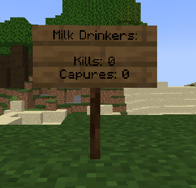
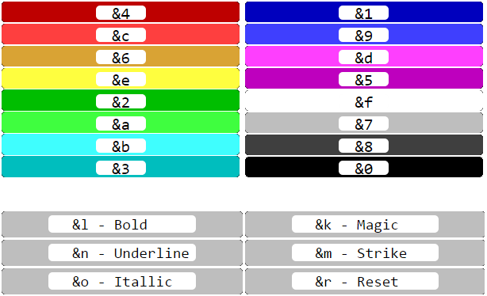

# Admins handbook

Admins need to manage and overview the game, and for this the main tool on their utility belt is the `/geekwars` (or `/gw`) command. With this command you can make players join or leave clans, promote them to leaders, and more.

## Table of contents

* [Joining and leaving a clan](#joining-and-leaving-a-clan)
* [Promoting and demoting clan leaders](#promoting-and-demoting-clan-leaders)
* [Changing chat colours](#changing-chat-colours)
* [Creating smart signs](#creating-smart-signs)
  * [Variable tags](#variable-tags)
  * [Variable tags usage example](#variable-tag-usage-example)
  * [Formatting codes](#formatting-codes)
  * [Smart sign usage example](#smart-sign-usage-example)

## Joining and leaving a clan

The following is the command for making a player join and leave a clan:
```
/gw clan join <player> <cows | sheep>
/gw clan leave <player>
```
The join command is intended to be in a command block at spawn for players to join into a clan of their choice, and
the leave command is only intended to be manually ran by admins in rare cases.

To see the players in a clan, run the following command:
```
/gw clan members list <cows | sheep>
```

For players to know which clan they're joining, placing the clan treasure heads is very simple. To obtain them, run the following command:
```
/gw clan gethead <cows | sheep> <active | inactive>
```

## Promoting and demoting clan leaders

To help run the game smoother and take some responsibility from the admins, clans can have their own _clan leaders_ that can manage their clan. To make someone a leader of their clan or revoke their leader status, do one the following commands:
```
/gw clan members promote <player>
/gw clan members demote <player>
```
**ONLY ASSIGN RESPONSIBLE AND TRUSTWORTHY PEOPLE AS CLAN LEADERS.** Since they have control over their clan's treasure, it's no fun if they abuse the commands they have available to them and ruin the game for everyone else.

## Changing chat colours

Since Geek Wars needs to display a prefix on a player's username when they're signed in to their clan, it has to take control over the team system. Because of this, there's a special command for allowing players to set their personal chat colours:
```
/gw settings setchatcolour <aqua | black | gold | blue ...> <player>
```
All vanilla colours are available. This command is intended to be run in command blocks at spawn for players to choose their own colours.

## Creating smart signs

To help display clan statistics you can use smart signs. Smart signs work in a similar way to normal signs, but with the added benefit of giving you more power to format the text and the ability to display automatically updating clan statistics.

### Variable tags

In order to create a smart sign simply place down a sign and make sure that anywhere in the sign text you include `#GW`. This `#GW` tag tells the plugin that you want this sign to be a smart sign, don't worry about it looking ugly: the tag won't actually be displayed on the sign.
To insert a variable into the sign you can use variable tags. Like the `#GW` tag these all start with a hash followed by some symbol. The available tags are:

- `#0` - Milk Drinkers kill counter: the amount of times a signed in Milk Drinker has killed a signed in enemy.
- `#1` - Milk Drinkers capture counter: the amount of times the Milk Drinkers clan have captured the enemy flag.
- `#5` - Wool Weavers kill counter: the amount of times a signed in Wool Weaver has killed a signed in enemy.
- `#6` - Wool Weavers capture counter: the amount of times the Wool Weavers clan have captured the enemy flag.

### Variable tag usage example

<!-- 
 -->


```
Milk Drinkers:
#GW
Kills: #0
Captures: #1
```
Once you finish editing the sign it will display like so:


Note that in this example the Milk Drinkers clan has 0 kills and has captured the Wool Weavers flag 0 times. Using these smart signs can be very useful as the signs automatically update. So if, for example, the Milk Drinkers got a kill then the sign would update and display `Kills: 1`.

### Formatting codes

If you've used colour/format codes in servers before then this may be familiar to you. These tags start with a `&` followed by some symbol, the available codes are:



### Smart sign usage example

Of course format/colour codes can be used along with variable codes to create some really neat signs:


```
&7&n&lKills:
#GW
&7MD: #0
&7WW: #5
```

Entering the above text would result in a sign that looks like this:


And of course these values would automatically update, so you don't need to worry about them becoming out of date.

> **Note:** Please don't use smart signs to simply make fancy signs: the more there are the greater each subsequent sign will impact performance. This impact should be negligible unless there are lots of these signs (100+ maybe). If you want fancy signs really badly then let us know, and I can make that possible with no impact to server performance.

If you're a leader as well as an admin, make sure you're up to date with the power at a leaders disposal by reading the [Leaders handbook](leaders-handbook.md). It's also very important you read the [Players handbook](players-handbook.md) to know how to play the game!
