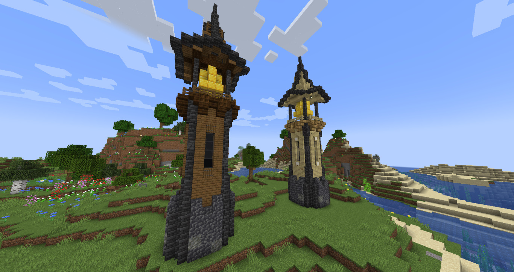

# Players handbook

Thanks for choosing to play and participate in the official Geek NZ Geek Wars! There's a couple of things you should know before you go into it, including how to score points for your clan, and geek etiquette. This handbook will tell you everything you need to know!

## Table of contents

* [Rules](#rules)
* [Finding the other clan's hall](#finding-the-other-clans-hall)
* [Capturing the other clan's treasure](#capturing-the-other-clans-treasure)
* [Preventing the other clan from capturing your treasure](#preventing-the-other-clan-from-capturing-your-treasure)
* [Getting kills](#getting-kills)

## Rules

Of course, we here on geek are all friends and this event is all for fun. In that spirit, basic gentlemen's rules apply meaning that:

- If you kill someone, you are expected to return their items to them, build a chest for them to collect their items, etc
- If you *get* killed by someone, don't go into a fit of rage! Say GG and move on
- This event doesn't change the fact that Geek NZ is a family friendly server - *keep conversations PG*
- All other Geek NZ Rules apply

With that out of the way, let's start talking *treasure!*

## Finding the other clan's hall

The treasure you seek is hidden away at the enemy clan's hall. To find it, you need to look out for one of these specific bell towers which mark that a clan hall is nearby:

Once you've found a tower, look around for hidden entrances to bases. Be careful! The clan hall might have traps or parkour to do before you can get to the treasure, and it may even be guarded. There should be no need to break blocks at their hall in order to get to the treasure so **do not grief.**

## Capturing the other clan's treasure

To capture the enemy's treasure, firstly you must be signed in to your clan. You can do this at your clan's hall. Right click it with an empty hand to pick it up, and return it to your clan's treasure to score a point. Easy, right? We thought so too. That's why while you're carrying treasure, you're significantly nerfed:

- You cannot use rockets with elytras, gliding only.
- Enderpearls don't work
- Nether portals don't work
- Carpet teleportation doesn't work

Yes that's right, the only way to carry the enemies treasure from their clan hall to yours is by _walking._ Doesn't sound so easy now, right? You'll need to work together with your team to be protected and score for your clan.

Once you capture the enemies treasure, it is sent back to their clan hall and deactivated, it will only activate once a day in the morning. This means you can only capture their treasure daily.

## Preventing the other clan from capturing your treasure

So what can you do to prevent the other clan from capturing your treasure? Options include keeping the location of your clan hall a tight keep secret, concealing it, and even booby-trapping the hall. Think Indiana Jones style!

If you manage to kill the carrier of your treasure, it will drop on the ground, and right-clicking it will send it back to your base.

## Getting kills

The other aspect of the Geek Wars is killing. If **and only if an enemy player is signed in to their clan** and you are signed in to yours, you can kill them for an extra point for your clan. Being signed in essentially puts a target on your back, so be careful!

When you are signed in, you have a prefix before your name showing what clan you're in - either `[WW]` or `[MD]`
